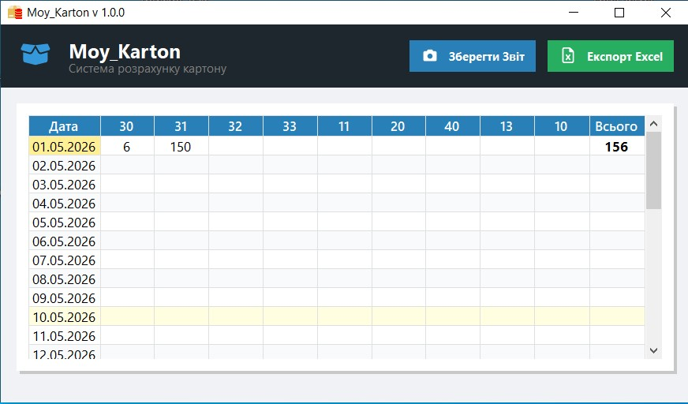

# 📦 My-Carton (Inventory Management System)

A lightweight and efficient desktop application built with C# (WinForms) for managing cardboard inventory, tracking materials, and automatically generating detailed Excel reports. 

## ✨ Features
* **Inventory Tracking:** Easily add, update, and monitor cardboard stock levels.
* **Excel Integration:** One-click export of inventory data to `.xlsx` format using ClosedXML (no MS Office installation required).
* **Automated CI/CD Pipeline:** Custom `.bat` scripts and GitHub Actions ensure automated building, packaging, and installer generation.
* **Easy Installation:** Automated setup wizard created with Inno Setup.

## 🛠️ Tech Stack
* **Language/Framework:** C#, .NET Framework 4.7.2, Windows Forms
* **Libraries:** ClosedXML, FontAwesome.Sharp
* **DevOps / Deployment:** MSBuild, Batch Scripting, Inno Setup

## 🚀 Installation & Usage
1. Go to the [Releases](../../releases) tab on the right.
2. Download the latest `MyCarton_Setup_v1.X.exe`.
3. Run the installer (Administrator privileges required to set up the local database structure).
4. Launch the application from your desktop shortcut!

## 🏗️ Architecture & Build Process
This project utilizes an automated build system. The core build script (`build.bat`) performs the following:
1. Restores NuGet packages.
2. Compiles the `.sln` using MSBuild.
3. Injects the custom application icon (`karton.ico`).
4. Packages the compiled client into an artifact archive.
5. Compiles a production-ready Windows Installer using Inno Setup compiler (`iscc`).

---
*Developed by Dmytro Kliuchko*